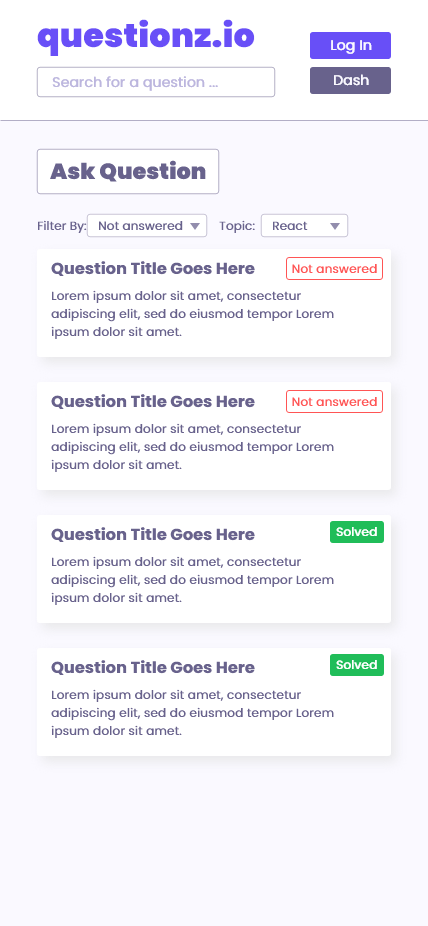

# Wireframes

## Home

## Question

## New Answer

## New Question

## Student Dashboard

# Colour Codes

<h2>Heading Purple</h2>

#684FF7

<h2>Solved / Success</h2>

#20BD59

<h2>Not Answered / Error</h2>

#FF5555

<h2>Content BG</h2>

#FAF9FF

<h2>Dark Grey</h2>

#504D5E

<h2>Mid Grey</h2>

#68628C

<h2>Light Grey</h2>

#928DAD

<h2>Light Purple / Placeholder Text</h2>

#BCB6DE

# Font

Poppins

## **Import**

@import url('https://fonts.googleapis.com/css2?family=Poppins:wght@400;700;900&display=swap');

## **CSS to apply**

font-family: 'Poppins', sans-serif;

## **Weights**

Poppins Black

font-weight: 900;

Poppins Bold

font-weight: 700;

Poppins Regular

font-weight: 400;
